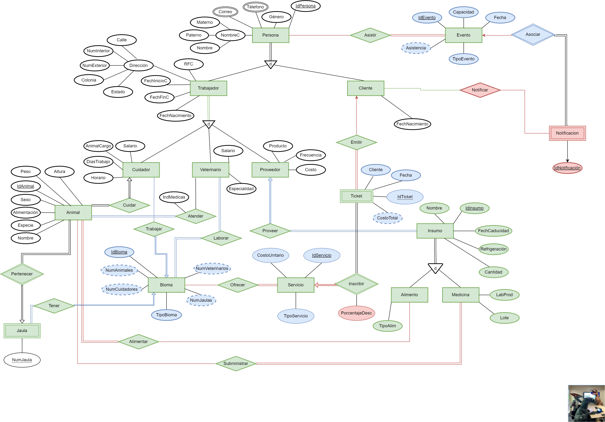
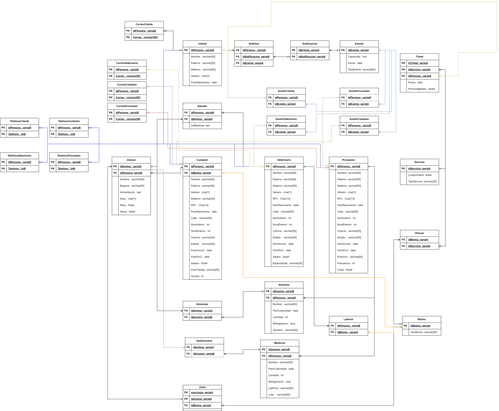

# 💿 **Practica 7** 🦘

# **Población de Bases De Datos**

La informacion detallada sobre que se realizo en esta practica puede ser consultada [aquí](./Docs/Specs-Práctica07.pdf).

---

# **Modelo Entidad-Relación de esta practica:**

---

# **Modelo Relacional de esta practica:**

---
# **“El Zoológico de Huitziltepec”**

La informacion detallada sobre el Zoológico de Huitziltepec puede ser consultada [aquí](./../../Teoria/00-Caso-De-Uso/El%20Zoológico%20de%20Huitziltepec.pdf).

