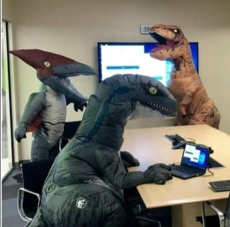
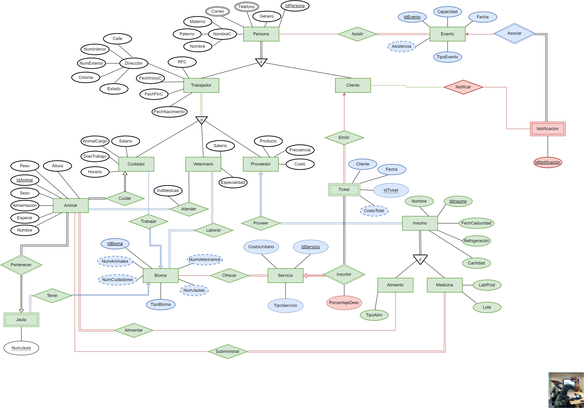
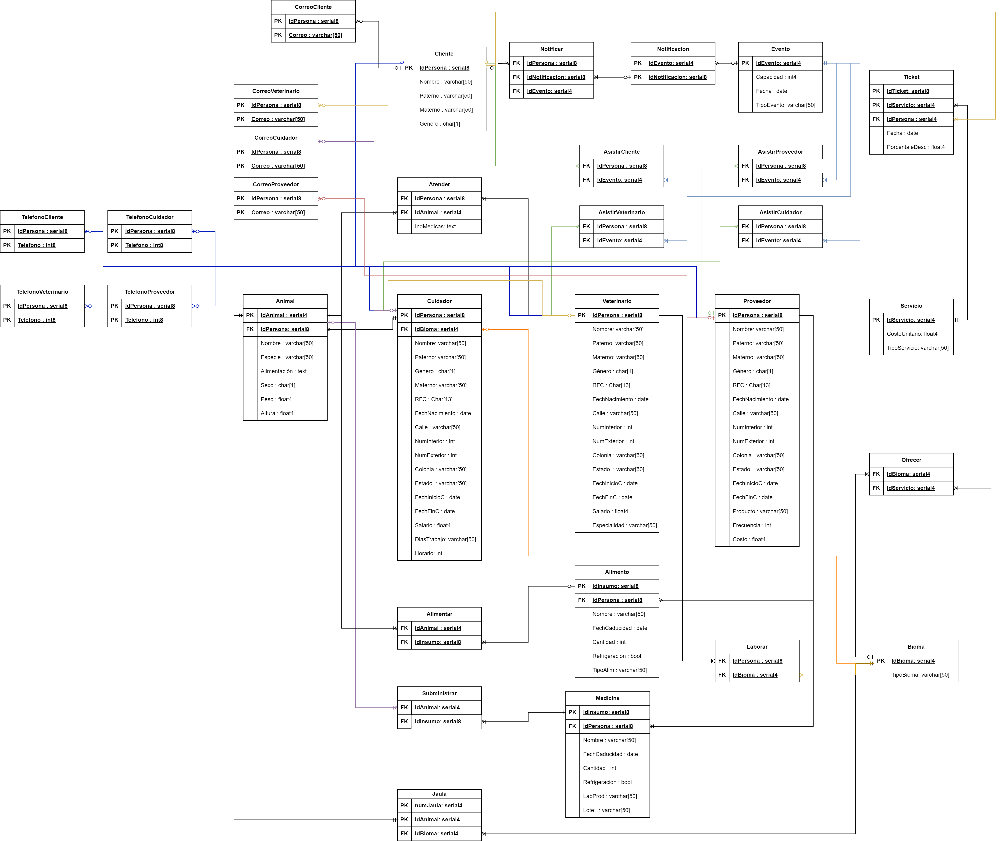

<div align="center">

# 📑📎 **Proyecto Final** 🦖🎸


</div>


<div align="center">

Integrantes del equipo:

```Haskell
\src> Castañon Maldonado Carlos Emilio
```

```Dart
\src> Navarro Santana Pablo Cesar 
```

```Kotlin  
\src> Nepomuceno Escarcega Arizdelcy Lizbeth
```

```Python
\src> Gallegos Diego Cristian Ricardo 
```

```Julia
\src> Chavez Zamora Mauro Emiliano 
```


[](https://www.youtube.com/watch?v=8bbTtPL1jRs)

</div>

El presente es el Proyecto Final de Fundamentos de las Bases de Datos, ademas de ser la culminacion de todas las practicas
es nuestra version definitiva sobre la base de datos implementada para el caso de uso del [Zoológico de Huitziltepec](./../Teoria/00-Caso-De-Uso/El%20Zoológico%20de%20Huitziltepec.pdf).

La informacion detallada sobre los requerimientos adicionales que requirio el presente se puede consultar [aquí](./Docs/Specs-ProyectoFinal_2024-1.pdf).


---

<div align="center">

# **Reporte ejecutivo de este Proyecto:**

</div>

```Dart
                                   ________________________________________________
                                  /                                                \
                                 |    _________________________________________     |
                                 |   |                                         |    |
                                 |   |  C:\>Proyecto/Docs/ReporteEjecutivo.pdf |    |
                                 |   |                                         |    |
                                 |   |                                         |    |
                                 |   |                                         |    |
                                 |   |                                         |    |
                                 |   |                                         |    |
                                 |   |                                         |    |
                                 |   |                                         |    |
                                 |   |                                         |    |
                                 |   |                                         |    |
                                 |   |                                         |    |
                                 |   |                                         |    |
                                 |   |_________________________________________|    |
                                 |                                                  |
                                  \_________________________________________________/
                                         \___________________________________/
                                      ___________________________________________
                                   _-'    .-.-.-.-.-.-.-.-.-.-.-.-.-.-.-.-.  --- `-_
                                _-'.-.-. .---.-.-.-.-.-.-.-.-.-.-.-.-.-.-.--.  .-.-.`-_
                             _-'.-.-.-. .---.-.-.-.-.-.-.-.-.-.-.-.-.-.-.-`__`. .-.-.-.`-_
                          _-'.-.-.-.-. .-----.-.-.-.-.-.-.-.-.-.-.-.-.-.-.-----. .-.-.-.-.`-_
                       _-'.-.-.-.-.-. .---.-. .-------------------------. .-.---. .---.-.-.-.`-_
                      :-------------------------------------------------------------------------:
                      `---._.-------------------------------------------------------------._.---'
                              
```

<!---
Creditos del arte ascii a -Roland Hangg-
Arte Ascii Recuperado de: https://www.asciiart.eu/computers/computers
-->


<div align="center">
  
[Reporte ejecutivo](./Docs/Reporte%20Ejecutivo%20Proyecto.pdf)


</div>


---

<div align="center">

# **Modelo Entidad-Relación de este Proyecto:**




</div>

---

<div align="center">

# **Modelo Relacional de este Proyecto:**




</div>


---

<div align="center">

# **Los Archivos SQL de la Base de Datos de este Proyecto:**

</div>

```Dart

                                        .---------------------------------.           
                                        |  .---------------------------.  |           
                                        |[]|                           |[]|           
                                        |  |                           |  |           
                                        |  |                           |  |           
                                        |  |                           |  |           
                                        |  |     C:\>Proyecto/SQL/     |  |           
                                        |  |                           |  |           
                                        |  |                           |  |           
                                        |  |                           |  |           
                                        |  |                           |  |           
                                        |  `---------------------------'  |           
                                        |      __________________ _____   |           
                                        |     |   ___            |     |  |           
                                        |     |  |   |           |     |  |           
                                        |     |  |   |           |     |  |           
                                        |     |  |   |           |     |  |           
                                        |     |  |___|           |     |  |           
                                        \_____|__________________|_____|__|
                              
```

<!---
Creditos del arte ascii a -David Palmer-
Arte Ascii Recuperado de: https://www.asciiart.eu/computers/floppies
-->


---
<div align="center">
  
# **“El Zoológico de Huitziltepec”**


La informacion detallada sobre el Zoológico de Huitziltepec puede ser consultada [aquí](./../Teoria/00-Caso-De-Uso/El%20Zoológico%20de%20Huitziltepec.pdf).


</div>

